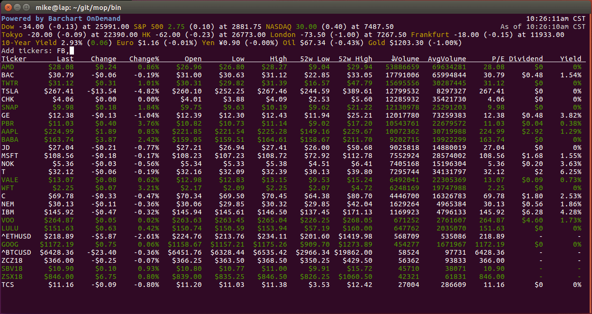

# Mop: track stocks the hacker way

Mop is a command-line utility that displays continuous up-to-date
information about the U.S. markets, commodities, ETFs, individual stocks and more. 


## Market Data now powered by Barchart OnDemand!



Get your FREE API Key: https://www.barchart.com/ondemand/free-market-data-api

### Installing

* Windows: 
* Mac: 
* Linux: 

### Using Mop ###

To run open a terminal and:

Note: if you are using a free API key you must pass the `--sandbox=false` flag.

`mop --key=YOUR_API_KEY --sandbox=false`

You can request a free Barchart OnDemand API from here: https://www.barchart.com/ondemand/free-market-data-api

For demonstartion purposes Mop comes preconfigured with a number of
stock tickers. You can easily change the default list by using the
following keyboard commands:

```
+       Add stocks to the list.
-       Remove stocks from the list.
o       Change column sort order.
g       Group stocks by advancing/declining issues.
?       Display help screen.
esc     Quit mop.
 ```

When prompted please enter comma-delimited list of stock tickers. The
list and other settings are stored in ``.moprc`` file in your ``$HOME``
directory.


### Building Mop ###

Mop is implemented in Go and compiles down to a single executable file.

Install Go 1.11

```
$ git clone git@github.com:barchart/mop.git
$ cd mop
$ make            # <-- Compile and run mop.
$ make build      # <-- Build mop in current directory.
$ make install    # <-- Build mop and install it in $GOPATH/bin.
```

### Contributing ###

This is a fork of: https://github.com/mop-tracker/mop

* Fork the project on Github.
* Make your feature addition or bug fix.
* Commit, do not change program version, or commit history.


### License ###

Copyright (c) 2018 Barchart. All Rights Reserved.
github.com/barchart

Copyright (c) 2013-2016 Michael Dvorkin. All Rights Reserved.
"mike" + "@dvorkin" + ".net" || "twitter.com/mid"

Permission is hereby granted, free of charge, to any person obtaining
a copy of this software and associated documentation files (the
"Software"), to deal in the Software without restriction, including
without limitation the rights to use, copy, modify, merge, publish,
distribute, sublicense, and/or sell copies of the Software, and to
permit persons to whom the Software is furnished to do so, subject to
the following conditions:

The above copyright notice and this permission notice shall be
included in all copies or substantial portions of the Software.

THE SOFTWARE IS PROVIDED "AS IS", WITHOUT WARRANTY OF ANY KIND,
EXPRESS OR IMPLIED, INCLUDING BUT NOT LIMITED TO THE WARRANTIES OF
MERCHANTABILITY, FITNESS FOR A PARTICULAR PURPOSE AND
NONINFRINGEMENT. IN NO EVENT SHALL THE AUTHORS OR COPYRIGHT HOLDERS BE
LIABLE FOR ANY CLAIM, DAMAGES OR OTHER LIABILITY, WHETHER IN AN ACTION
OF CONTRACT, TORT OR OTHERWISE, ARISING FROM, OUT OF OR IN CONNECTION
WITH THE SOFTWARE OR THE USE OR OTHER DEALINGS IN THE SOFTWARE.
